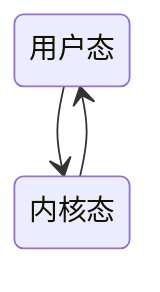

# 什么是处理器管理？

管理、调度和分派 处理器，控制程序执行

资源分配；进程调度

进程：资源分配和管理的单位；线程：处理器调度的单位

# 处理器的相关知识

regs，user and kernel

PSW：一组值
哪个程序的PSW在CPU上，CPU正在跑哪个程序。

中断发生将PSW保存到栈上。（这部分不是软件做的
Sp指向的就是栈（一个内存空间

# 中断技术

中断：向CPU报告设备已经完成某某操作。并法基础

优先级；中断屏蔽；快中断慢中断；delay

# 进程与线程

用户空间实现线程：eg POSIX

可移植，但一个阻塞整个进程阻塞。

## 进程上下文

### 处理器状态转换

此时仍在同一个进程中运行。

# 处理器调度

考虑的主要因素：

1. 资源利用率CPU有效工作时间/CPU总运行时间
2. 吞吐率：单位时间内处理的作业数
3. 公平性：确保每个用户，每个进程获得合理的CPU份额或其他资源份额，不会出现“饿死”现象
4. 响应时间（分时系统、实时系统）：从作业提交到收到回应的时间
5. 周转时间（批处理系统）：作业提交开始到作业完成的时间 
   	平均周转时间（t完成时间 - t到达时间）求和/ n、平均带权周转时间（权值=t周转时间/t所需运行时间）

# 作业管理与调度

等待时间：从job到达一直到被完全**开始**调度执行的时间

周转时间：从job到达一直到被完全调度执行**结束**的时间（等待时间+处理时间）

aging：$𝑇_{n+1}=𝑎\; t_n+(1−𝑎)𝑇_n$；$T_1=t_1$

# 低级调度

什么是实时系统？

–时间因素非常关键的系统，强调响应时间
$$
\sum_{i=1}^{m}\frac{C_{i}}{P_{i}}\leq 1
$$

其中m为事件总数，Ci为某个事件的处理时间，Pi为事件发生的周期